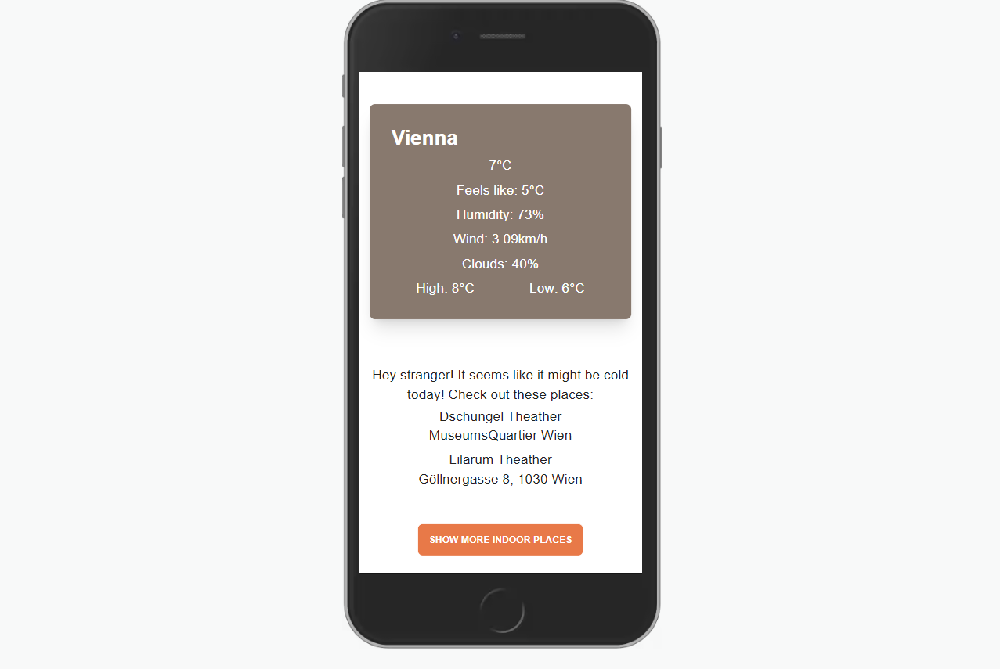
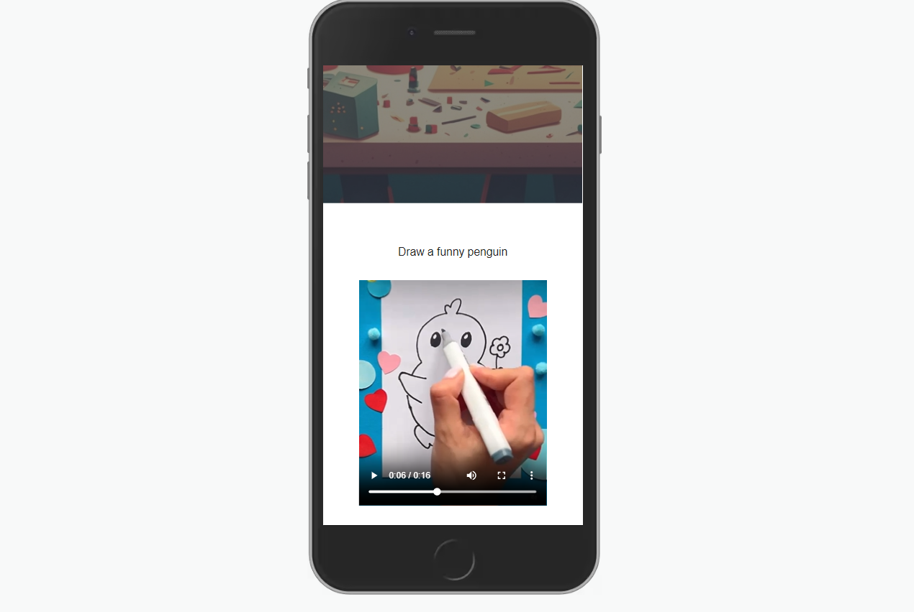

# Vienna with little ones

**Description:** Full-stack app that allows users to discover locations within a city, add new locations to a map, add reviews to existing locations, check the weather in real-time and stream videos.

---

**Landing Page** User can check places on a map and filter between outdoor and indoor places.

**User reviews and single location page:** Here user can see the single location. In order to write a review, users need to register and make an account.

**Add a new place page:** Here user can add a new location, upload an image of the location, write a description and set the type of the location to outdoor or indoor. Location will be added to the database and it will be shown on the map.

**Weather page:** Here user can check weather in real time and based on the temperature the list of suggestion will be shown.

**Crafts page** Crafts videos streamed from Amazon CloudFront.

---

**Technologies used:**

- Next.js for server-side-rendering and Front End development.
- PostgreSQL for database managment.
- Ley Migration for database schemas update
- MapBox for Geocoding Api
- React Leaflet for the map, markers, pop ups.
- OpenWeatherMap for Weather Api
- AWS and cloudFront for content delivery and caching.

**Setup Instructions:**

- $ git clone the GitHub repo onto your local machine.
- Install Next.js by running yarn add create-next-app or npx create-next-app.
- Similarly, install PostgreSQL for database function.
- Install required dependencies.
- Run yarn dev to start the server and go to the proposed host url.
- You are in the project..yippi. :)
