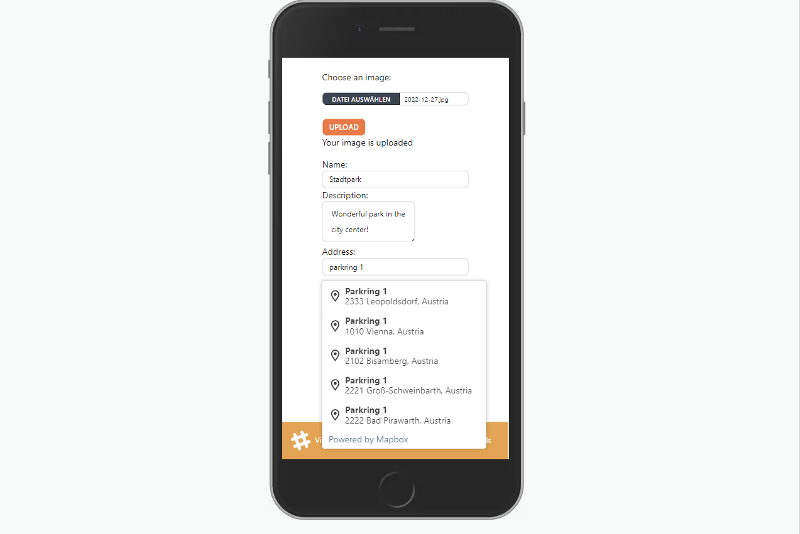
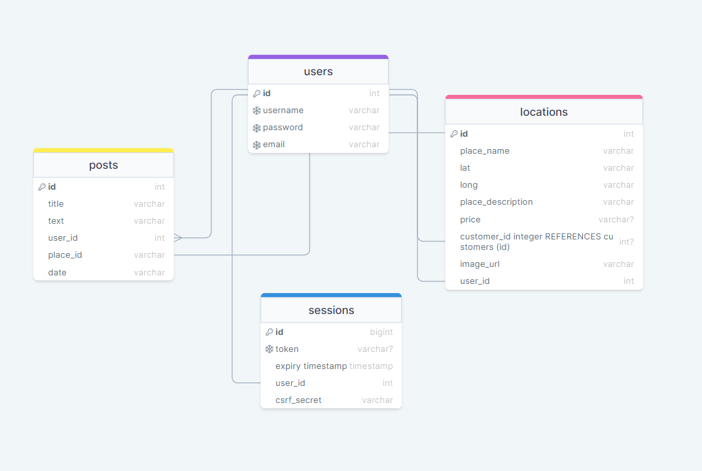

# Vienna with little ones

**Description:** Full-stack app that allows users to discover locations within a city, add new locations to a map, add reviews to existing locations, check the weather in real-time and stream videos.

---

**Screenshoots**

---

**Landing Page** User can check places on a map and filter between outdoor and indoor places.
<br>


**Add a new place page:** Here user can add a new location, upload an image of the location, write a description and set the type of the location to outdoor or indoor. Location will be added to the database and it will be shown on the map.
<br>


**Weather page:** Here user can check weather in real time and based on the temperature the list of suggestion will be shown.
<br>


**Crafts page** Creating an S3 bucket, uploading the videos and creating CloudFront distribution.
<br>


**User reviews and single location page:** Here user can see the single location. In order to write a review, users need to register and make an account.
<br>


**Database Schema**


---

**Technologies used:**

- Next.js for server-side-rendering and Front End development.
- PostgreSQL for database managment.
- Ley Migration for database schemas update
- MapBox for Geocoding Api
- React Leaflet for the map, markers, pop ups.
- OpenWeatherMap for Weather Api
- AWS and cloudFront for content delivery and caching.

**Setup Instructions:**

- $ git clone the GitHub repo onto your local machine.
- Install Next.js by running yarn add create-next-app or npx create-next-app.

**Setup the database by downloading and installing PostgreSQL**

- Create a user and a database
- Create a .env file. Check .env.example file to see what info should be provided
- Copy the environment variables from .env-example into .env
- Replace the placeholders xxxxx with your username, password and name of the database
- Install dotenv-cli with yarn add dotenv-cli
- Run the migrations with yarn migrate up
- Start the server by running yarn dev

**API Keys and Dependencies**

- Install required dependencies.
- Open Weather account for the weather information. Add your Api key to the env file.
- Mapbox account for Geocoding. Add your Api key to the env file.
- Run yarn dev to start the server and go to the proposed host url.

  **You are in the project..yippi. :)**

## Deployment instructions

Sign up on Fly.io
On the Fly.io Tokens page, generate a new Fly.io access token named GitHub Actions Deploy Token and copy it from the text box that appears - it will only be shown once

In GitHub repo under Settings → Secrets → Actions, click the New repository secret button at the top right of the page and create a new token with the name FLY_API_TOKEN and the token copied as the secret
On the command line, open the Fly.io login page in my browser using the following command:

```
flyctl auth login
```

Enter credentials in the browser window that appears and then click on the link Try Fly.io for free. Switch back to the terminal - it should now show a message like successfully logged in as <your email>.

Create an app, specifying the name using only lowercase letters and dashes:

```
flyctl apps create --name <app name>
```

Create the Fly.io config files as demonstrated in the lecture (also available in the Next.js example repo)

Change your database/connect.ts as in the lecture: only run config() from dotenv-safe if the FLY_IO environment variable is not set
Change your next.config.js as in the lecture: disable linting and type checking on build, since we do this earlier in the GitHub Actions deploy process

Add database credentials using Fly.io secrets, randomly generating the database name, username and password:

```
flyctl secrets set PGHOST=localhost PGDATABASE=upleveled$(openssl rand -hex 16) PGUSERNAME=upleveled$(openssl rand -hex 16) PGPASSWORD=$(openssl rand -base64 32)
```

If your app needs any additional environment variables such as API keys, also add them to the secrets using the following pattern:

```
flyctl secrets set <secret name>=<secret value>
```

The Next.js documentation mentions exposing variables to the browser using variables prefixed with NEXT*PUBLIC*. Instead of using environment variables for this, we recommend declaring a JavaScript variable in your code because this information is not secret - it will be exposed to the browser. If you absolutely need to set a NEXT*PUBLIC* environment variable, you can add it to your .env.production file.

Create a 1GB volume for the PostgreSQL database in the Frankfurt region:

```
flyctl volumes create postgres --size 1 --region fra
```

Deploy the first version of the app:

```
flyctl deploy
```

You may receive a failed to fetch an image or build from source error during deployment:

Error failed to fetch an image or build from source: error building: executor failed running [/bin/sh -c yarn build]: exit code: 1

Deploys may fail for a number of reasons, to find the real error message you will need to scroll up in the logs and find the first line that looks like an error.
